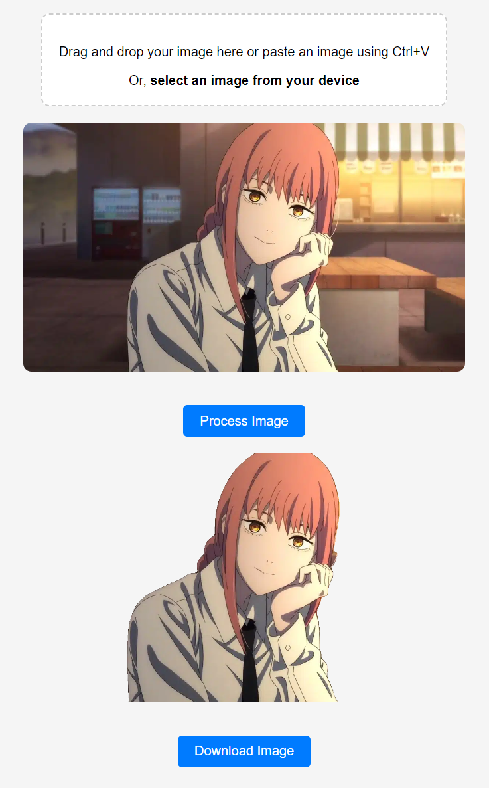

# rembg-webapp

This is a simple Flask web application to remove backgrounds from images using the [rembg library](https://github.com/danielgatis/rembg).

## Run

1. 
    ```bash
    pip install -r requirements.txt
    ```

2. 
     ```bash
    python app.py
    ```
3. Open your web browser and go to `http://localhost:5000`.

## Screenshot


